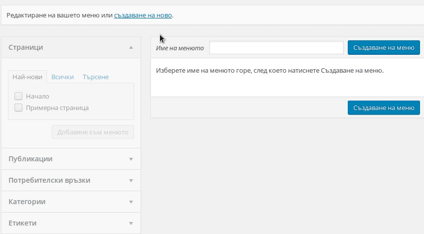
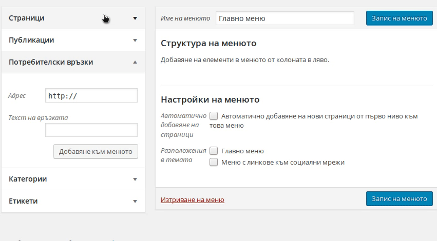
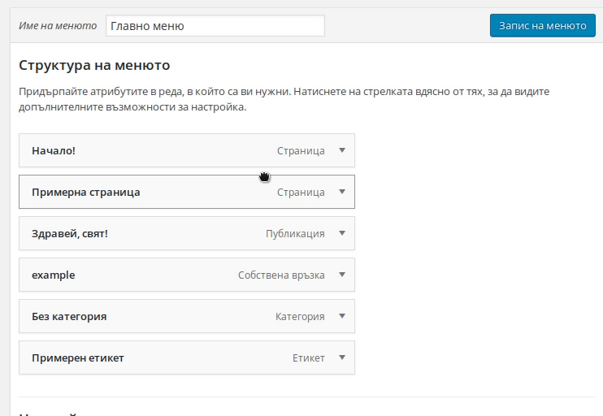

## Създаване и управление на менюта.

  - *Създаване на меню.* По подразбиране, след началната инсталация на WordPress, няма създадено меню. За да създадем такова, отваряме `Външен вид > Менюта`
  в административният панел на сайта. Даваме име на новото меню(напр. *Главно меню*) в полето `Име на менюто` и натискаме бутона
  `създаване на меню`.

  

  - *Добавяне на връзки в менюто.* След като вече сме създали менюто, е време да сложим някакво съдържание в него. В лявата част на екрана са изброени различните типове връзки,
  които са налични за вмъкване в менюто. Под `Страници` ще можете да изберете измежду всички налични страници, които можете да подредите по
  най-нови(последните 5), списък със всички страници или пък да търсите за конкретна в търсачката. По идентичен начин можете да добавите 'Публикаци',
  'Категории' и 'Етикети'. Сложете отметка върху съдържанието, към което искате да води връзката и натиснете `Добавяне към менюто`.

  Освен добавяне на директни връзки към съществуващо на сайта съдържание, чрез секцията `Потребителски връзки`, можете ръчно да добавяте ръчно адреси
  към външни сайтове в свободен текст. Нужно е само да попълните полетата `Адрес`(*Адресът, към който искате връзката да води*) и `Текст на връзката`(*Текстът, който да се показва в менюто*).

  

  Вече добавените връзки в менюто могат да бъдат свободно пренареждани чрез придърпване с мишката. Чрез привлачване на дадена връзка надясно, можете да я направите подменю на горната.
  Можете да редактирате вече добавените връзки, чрез натискане на стрелката в дясната им част.

  След като сме направили нужните промени по менюто, остава да изберем локацията, на която ще се показва. Това се случва в секцията `Настройки на менюто`, в долната част на страницата.
  Слагаме отметка до позициите, в които искаме текущото меню да се показва и натискаме `Запис на менюто`.
  *Имената, позициите и броят на меню локациите зависят изцяло от темата, която се ползва.*

  

[*Начало*](README.md)
