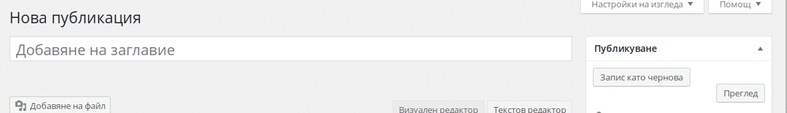

## Добавяне на публикации и страници

Добавянето на нови публикации и страници се случва по идентичен начин, с дребни разлики. Ще разгледаме първо публикациите и след това разликите между тях и страниците. Добавянето на публикации и страници се случва от `Публикации > Добавяне` и `Страници > Добавяне` съответно.

#### Елементи на публикациите
  *Ако не намирате някоя от настройките, за които ще говорим по-долу, проверете менюто 'Настройки на изгледа'(В горния десен ъгъл), и сложете отметка на настройките, които искате да бъдат видими.*
  

  - Заглавие - Заглавията трябва да бъдат кратки и описателни. Твърде дълги заглавия могат да създадат потенциални проблеми с показването им в някои теми.

  - Кратка връзка('Slug') - Това е краткото име на статията, което се показва в URL адреса. По подразбиране се използва заглавието на страницата. Добре е връзките да бъдат редактирани така че да бъдат кратки(една - две думи) и на латиница.

  - Редактор на съдържанието
    - Визуален редактор - Има всички стандартни възможности за форматиране на текст и лесно вмъкване на медийни файлове. Първият ред с бутони за форматиране показва базовата функционалност, нужна за създаването на публикацията. Последният бутон `Показване/скриване на лентата с инструменти`, разкрива допълнителна функционалност за форматиране(Размер на текста, оцветяване, специални символи и тн.). Можете да добавяте файлове от библиотеката или да качвате нови такива, чрез бутонът `Добавяне на файл`. Директни връзки към популярни услуги, напр. youtube видеа или twitter съобщения, ще бъдат автоматично вграждани в редактора.
    - Текстов редактор - Ако желаете да пишете ръчно страницата в HTML формат, можете да го направите от раздела `Текстов редактор`.

  - Коментари - От тук можете да разрешавате/забранявате коментарите за конкретната публикация/страница.

  - Автор - Стига да имате нужното ниво на достъп, позволява да назначите различен автор за конкретната публикация.

  - Публикуване
    - Статус
      - Публична - публикацията е видима за всички посетители на сайта.
      - Очакваща преглед - Публикацията не е видима на сайта, и е маркирана за преглед от администратор/редактор преди публикуване.
      - Чернова - Публикацията не е видима на сайта и е достъпна само от Вас и потребителите с ниво на достъп 'Редактор' и по-високо.
    - Достъпност
      - Публична - Публикацията е видима за всички посетители на сайта.
      - Защитена с парола - Публикацията е видима на сайта, като съдържанието ѝ се показва само след въвеждане на зададената парола.
      - Лична - Публикацията е видима на сайта само за Вас и за потребители с ниво на достъп 'Редактор' и по-високо.
    - 'Публикувана на' - Дава Ви възможност да промените датата на публикуване
      - Ако датата е в бъдещето - Публикацията ще бъде публикувана автоматично на датата, която посочите;
      - Ако датата е минала - Публикацията ще бъде вмъкната в архива на посочената дата.

  - Категории - От тук можете да изберете категориите, в които текущата публикация ще принадлежи, от съществуващите категории, или пък да създадете нова категория, ако не съществува. Няма ограничение на броят категории, в които дадена публикация може да принадлежи.

  - Етикети - Позволява въвеждане на етикетите, които искате да закачите към текущата публикация. В полето могат да бъдат въвеждани повече от един етикет, разделени със запетая(`, `).

  - Основно изображение - позволява избор на изображение за конкретната публикация. Как се показва на сайта зависи изцяло от темата, обичайно се използва в архивните страници, и над съдържанието на публикациите.

  

#### Страници

  Създаването на нови страници е идентично с публикациите, с няколко разлики:

  - Страниците не поддържат категоризиране с таксономии(категории и етикети);
  - Страниците могат да бъдат подреждани йерархично, чрез полето `Родител`.
  - По подразбиране страниците са подредени по азбучен ред, но ако искате да промените това, можете да го направите чрез полето `Подредба`. То приема числа, като колкото по-малко е числото, толкова по-нагоре ще бъде страницата(напр. 1 за първата).
