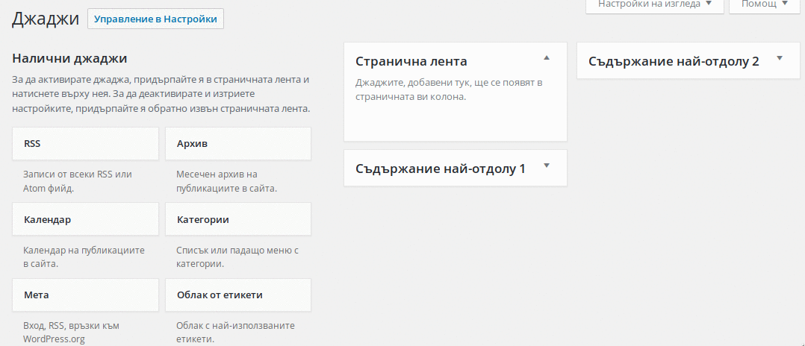

## Джаджи и странични ленти

  Джаджите са малки модулчета, които добавят различни функционалности сайта. Няколко примера:
    - Последни публикации - Списък с последно добавените публикации;
    - Страници - Списък със страниците на сайта;
    - Календар - Календар, с връзки до архивните страници за конкретни дати;
    - Текстова джаджа - Произволен текст, който искте да сложите в странична лента;
    - Собствено меню - Показване на някое от менютата на сайта във вертикален списък.
    - Търсене - Поле за търсене в сайта.
  Джаджите имат неограничен брой и могат да бъдат поставяни във всяка от страничните ленти.

  Страничните ленти са локациите, в които поставяме джаджи, като броят, имената и позициите им
  зависят изцяло от темата, която се използва на сайта. Обичайно има лява/дясна странична лента,
  както и лента на футъра, понякога и в хедъра(челото) на сайта.

  Управлението на джаджите се случва във `Външен вид > Джаджи`. В лявата част на екрана се намират
  инсталираните на сайта(но неактивни) джаджи. От дясно са всички странични ленти, в които можете да
  поставяте джаджи. Активирането на джаджите се случва чрез провлачване от лявата част, към някоя от
  страничните ленти.

  
